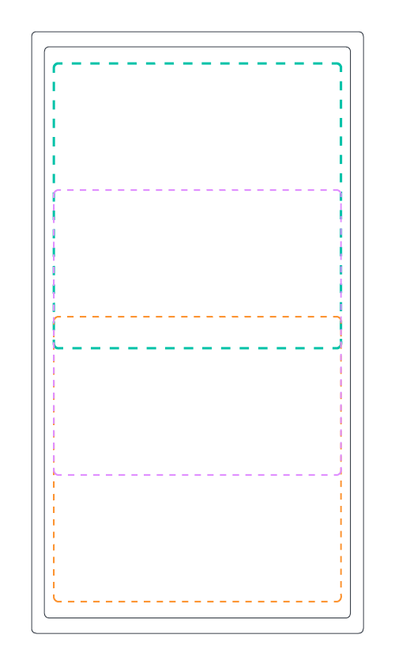

### Intro

In this post (my first, in fact), I'm going to talk about one of the most interesting projects I've worked on over the
last 5 years. The project's headline: __Can we develop an Android app that classifies screenshots on a mobile phone?__

Although a lot of excellent mobile development went into this project, my main focus was developing the computer 
vision model that would classify the screenshots and embedding the model into the app. I won't go into specific 
details about the app's purpose (to save myself from potentially getting into trouble), but I will say that it was  
built to monitor what people were doing on specific phones.

### Phase 1: Model Embedding

I'd now consider myself to be a [PyTorch][pytorch] convert (a topic for another day), however, this project was developed
using [TensorFlow][tensorflow] (tf). Initially, I attempted to use a pre-trained open-source model that I found online.
This is where TensorFlow Lite [tflite] came in handy; it enables you to convert a 
model into a compressed .tflite file that can then be embedded onto edge devices.

Why was the model embedded into the app instead of hosted in the cloud? There are a few reasons why
deploying the model locally on the app was a better solution in our situation. It can be fairly expensive to host 
a model on AWS; in contrast, it is essentially free to have the same model running locally on the device. It's possible 
that the device isn't always connected to the internet, but we still want to classify screenshots, without having to
store a large backlog of images to send to a cloud hosted model.

[tflite]: https://www.tensorflow.org/lite
[pytorch]: https://pytorch.org/ 
[tensorflow]: https://www.tensorflow.org/ 

The process of converting the original model into the tflite format was surprisingly painful. 
The open-source model was developed using the legacy tf 1.x API, and there isn't the same level of
support for older tf versions. However, with the current tf 2.x API, it's fairly straightforward to 
use the tflite conversion API or command-line tool.

Once I managed to overcome the model conversion hurdle and had a nice compressed tflite file, we embedded the model
into the app and started UAT testing. We quickly discovered that the model was performing poorly 
compared to the benchmarks we had established.

> My first lesson learned: In any ML project, it's best to source training data that matches the data the 
model will see when deployed to production. This sounds obvious in hindsight, but at the time I didn't 
realise it was necessary to use mobile phone screenshots as part of the training data to achieve 
reasonable results. This turned out to be a very naive assumption. The concept of a mismatch between your 
training data and the data that the model is exposed to in production is known in the MlOps world as *data drift*.

### Phase 2: Transfer Learning

The next step was to try and take the existing model and continue the training, using labelled mobile screenshot data. 
The model made it into production, but it wasn't performing to the client's satisfaction. The app worked in 
such a way that any screenshots classified as positive would be securely sent to the client's servers when 
an internet connection could be established. However, they were receiving too many false positives, and 
the team responsible for assessing the images couldn't keep up, especially as the number of active devices increased.

> An overarching lesson I learned from this project is that when delivering anything involving ML, it's crucial 
that everyone is on the same page regarding the performance of the model and the 
corresponding business implications. In this case, it was important that everyone understood 
a false positive rate of 1% meant that out of every 100,000 'negative' images, the model 
would still incorrectly classify approximately 1000 of them as positive. 


*This image shows how the screenshots were segmented as part of the image pre-processing. This was done to 
ensure that the images passed to the model maintained their aspect ratio after they were resized. Many models 
expect the images pass to them to be a fixed high and width (in terms of pixels) and therefore resizing is a 
common pre-processing step.*

### Phase 3: Custom Training

Based on the need to further reduce the false positive rate, I decided to train a new bespoke model. 
Fortunately, this turned out to be a good move. Machine Learning has continued to evolve rapidly over the last decade; 
just look at where we are now with generative models, and in the 3 years since 
the original open-source model was developed there had been many advances made in terms of model architectures and efficiency.

When deploying ML onto an edge device, there is a trade-off between model performance (how good the model is at its job) and device performance. 
Generally, larger models with more parameters are more likely to be better at whatever 
they're trained to do, given sufficient training data. However, embedding large models over a certain size, in 
terms of parameters, onto edge devices is challenging, because of hardware limitations such as compute power and battery life.
This is likely to be an interesting conundrum faced by people trying to embed large language models and other generative models onto edge devices. 

Fortunately, at the time of development, several model architectures had been purposely designed 
for mobile devices. After some experimentation, MobileNetV3, from the [mobilenet][mobilenet] family, emerged as the winner. 
Although there are better options nowadays, at the time MobileNetV3 offered the best trade off between model 
and device performance. I trained the MobileNetV3 model on AWS Sagemaker, using Sagemaker studio. 
You can find examples of some of the helper scripts that enabled me to do this [here][sagemaker-repo].

[mobilenet]:https://keras.io/api/applications/mobilenet/

### AWS Sagemaker

When training models using Sagemaker, you have 3 different options to choose from: 

* Use the built-in algorithms.

* Use bespoke code that can be run in a Sagemaker provided container.

* Provide your own bespoke code and docker image.

I decided to go for the second approach, using my own TensorFlow code in the Sagemaker provided TensorFlow container. 
There some a few nuances to this approach, but generally I found it to be more straight-forward than the other two options. 
Using my code and a Sagemaker provided TensorFlow container offered a good trade-off between flexibility and speed. Historically, 
I've found the built-in algorithms to be a bit awkward to configure and there was no need to create my own docker image
because Sagemaker had me covered with the containers they provide. 

```python
from sagemaker import get_execution_role
from sagemaker.tensorflow import TensorFlow

role = get_execution_role()

training_data_uri = 's3://<path to training data>>'
validation_data_uri = 's3://<path to validation data>'
fit_input = {'train': training_data_uri, 'validation': validation_data_uri}

hyperparameters = {
    'batch-size': 32,
    'fine-tune-learning-rate': 1.0e-04,
    'fine-tune-epochs': 1,
    'fine-tune-layer': 100,
}

metric_definitions = [
    {'Name': 'validation accuracy', 'Regex': 'val_accuracy: ([0-9\\.]+)'},
    {'Name': 'training accuracy', 'Regex': ' accuracy: ([0-9\\.]+)'},
]

tf_estimator = TensorFlow(
    entry_point='<name of your training script>.py',
    role=role,
    instance_count=1,
    instance_type='ml.p3.2xlarge',
    framework_version='2.4.1',
    py_version='py37',
    hyperparameters=hyperparameters,
    metric_definitions=metric_definitions
)

tf_estimator.fit(fit_input)
```
*Template for creating a single training run on SageMaker.*

[sagemaker-repo]:https://github.com/BenhamOT/aws-sagemaker-custom-training-example

There are a variety of benefits that come from using Sagemaker, although they do come with a potentially sizeable price tag. 
First, you have access to the best hardware (GPUs), which are required for training most of the larger models we see around nowadays. 
Additionally, training can be easily distributed across multiple GPUs, dramatically reducing training time.
This feature was especially helpful because the model I was training would take about 10 times longer to train locally,
even though it was relatively small. Hyperparameter tuning is also easier using Sagemaker; you can 
specify the total number of trainings runs and the number of runs to run in parallel. Sagemaker will then
use it's built-in bayesian optimisation algorithm to intelligently search for the most optimal 
combination of parameters based on a metric you provide.

### The end

The custom mobilenet model, trained using a mixture of mobile screenshot and non screenshot data, performed well enough
overall for the app to be installed on hundreds of active devices. We did propose a second phase to the project which would 
have seen us create a cloud hosted solution for further image analysis and incorporate more MlOps, such as automatic 
model retraining, into our build pipelines. This phase never went ahead but, on the bright side, the app is still
running in production, classifying screenshots. If you enjoyed this post, or if 
you didn't, and would like to read future ones, feel free to follow me on LinkedIn.
